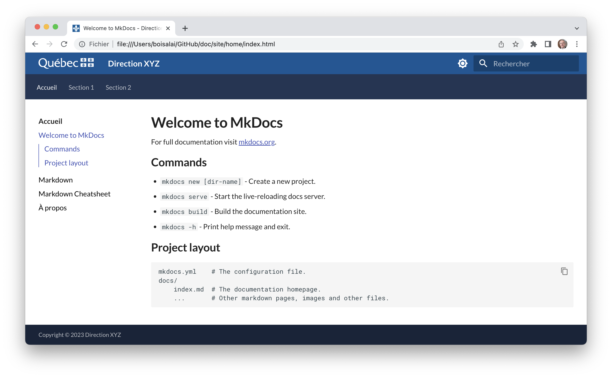
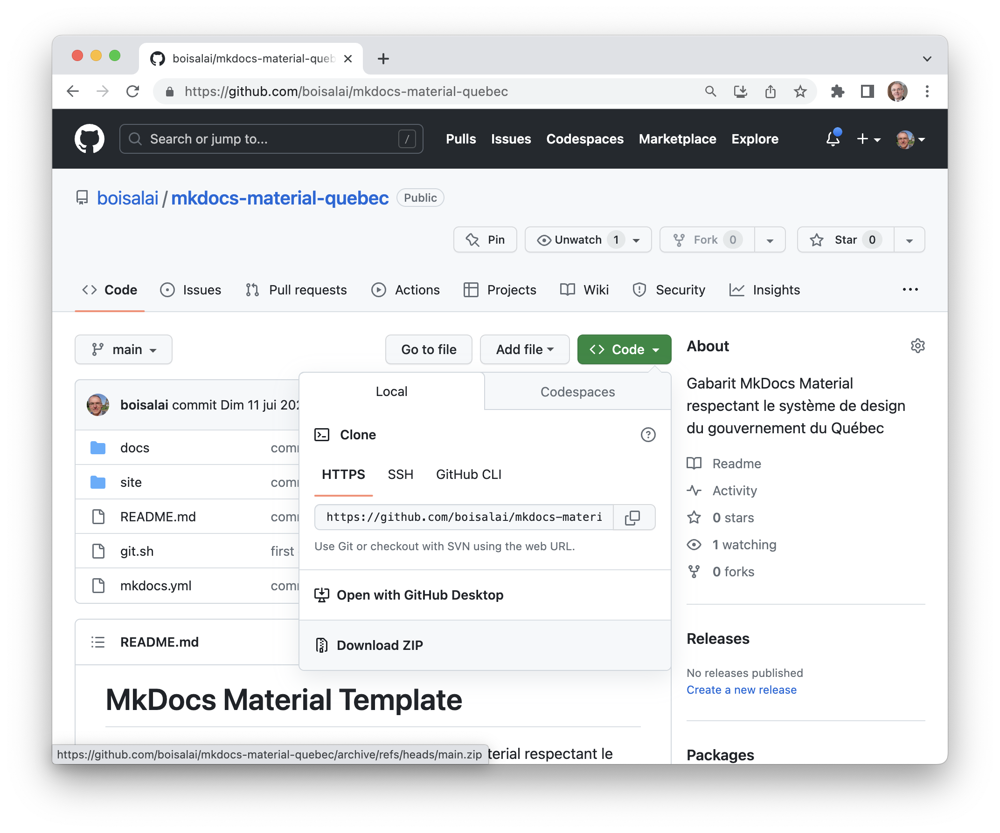
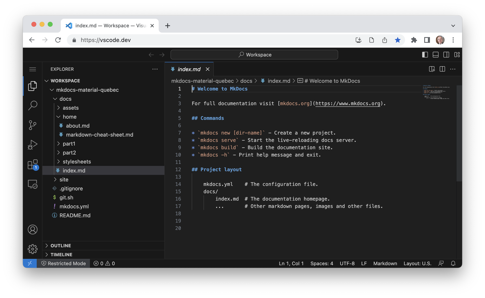

# Gabarit MkDocs Material

Ce dépôt GitHub propose un gabarit MkDocs Material qui respecte, dans la mesure du possible, le 
[système de design du gouvernement du Québec](https://design.quebec.ca/apercu/systeme).



[MkDocs](https://www.mkdocs.org/) est un générateur de site statique rapide, simple et attrayant, spécialement conçu pour créer la 
documentation de projets.

Les fichiers sources de la documentation sont rédigés en [Markdown](https://www.markdownguide.org/) et configurés à l'aide d'un seul fichier 
de configuration YAML.

[mkdocs-material](https://squidfunk.github.io/mkdocs-material/) est un thème pour le générateur de documentation MkDocs qui propose un 
ensemble de principes et de directives de conception permettant de créer des interfaces utilisateur modernes, attrayantes et cohérentes.

## Utilisation

Les instructions ci-dessous supposent que l'utilisateur n'a aucun droit d'administration sur son ordinateur, n'a pas accès à la fenêtre du terminal et n'a pas Python.

### Étape 1: Téléchargez le gabarit MkDocs

Téléchargez ce [dépôt GitHub](https://github.com/boisalai/mkdocs-material-quebec) au format ZIP en cliquant sur le bouton **Code**, 
puis sélectionnez **Download ZIP**.



Ensuite, décompressez le fichier ZIP (son nom devrait être `mkdocs-material-quebec-main.zip`). 
Vous pouvez déplacer le répertoire `mkdocs-material-quebec-main` où vous le souhaitez sur votre ordinateur ou votre réseau local.

Voici la structure de ce répertoire :

```txt
.
├── README.md
├── docs
│   ├── assets
│   │   ├── favicon-32x32.png
│   │   ├── fig1.png
│   │   ├── fig2.png
│   │   ├── fig3.png
│   │   └── signature-PIV.svg
│   ├── home
│   │   ├── Markdown-Cheatsheet.md
│   │   ├── about.md
│   │   ├── index.md
│   │   └── markdown-folder
│   │       ├── assets
│   │       │   └── 3.png
│   │       └── markdown.md
│   ├── part1
│   │   ├── page1.md
│   │   └── page2.md
│   ├── part2
│   │   ├── page1.md
│   │   └── page2.md
│   └── stylesheets
│       └── extra.css
├── git.sh
└── mkdocs.yml
```

Le répertoire contient quatre types de fichiers :

* Les fichiers `*.md` sont des fichiers de documentation en format Markdown. 
* Les fichiers `*.png` sont des images.
* Le fichier `docs/stylesheets/extra.css` est un fichier de styles CSS pour reproduire le design du gouvernement du Québec.
* Le fichier `mkdocs.yml` est un fichier de configuration. 

Le répertoire `docs/assets/` contient les images utiles (par exemple, le logo du gouvernement du Québec). Normalement, vous ne devriez pas 
modifier ce répertoire.

Les répertoires `docs/home`, `docs/part1` et `docs/part2` contiennent des pages de votre documentation sous la forme de fichiers au format 
Markdown. Vous pouve modifier ces répertoires et leurs fichiers pour créer votre propre documentation.

Vous pouvez supprimer les fichiers `README.md` et `git.sh` qui sont inutiles pour votre usage.

### Étape 2: Rédigez votre documentation

Rédigez votre documentation dans des fichiers au format Markdown (avec l'extension `.md`) à l'intérieur du répertoire `docs`.

Vous pouvez créer et modifier des fichiers Markdown avec Visual Studio Code (VS Code). Utilisez VS Code directement dans un navigateur web, 
sans avoir à installer l'application sur votre ordinateur. Il suffit de vous rendre sur [https://vscode.dev/](https://vscode.dev/).



### Étape 3: Ajustez le fichier de configuration `mkdocs.yml`.

Changez la ligne `site_name:` en remplaçant le nom par celui de votre documentation.

Ajustez la structure de navigation dans la section `nav:` pour qu'elle corresponde à votre structure de documentation.

```yaml
site_name: Direction XYZ
[...]
nav:
  - Accueil:
    - home/index.md
    - home/markdown-folder/markdown.md
    - home/Markdown-Cheatsheet.md
    - home/about.md
  - Section 1:
    - part1/page1.md
    - part1/page2.md
  - Section 2:
    - part2/page1.md
    - part2/page2.md
```

N'hésitez pas à modifier le contenu et la structure de votre documentation selon vos besoins. 

### Étape 4: Générez votre documentation 

Compressez le répertoire `mkdocs-material-quebec-main` pour créer le fichier `mkdocs-material-quebec-main.zip`.

Ouvrez ce [fichier Google Colab](https://colab.research.google.com/drive/17bBL-oIsmS3bYaSN3tf6FhZ1EA9KFEJG?usp=sharing).

Google Colab est une plateforme de développement et d'exécution de code en ligne, gratuite, principalement utilisée pour le langage de programmation Python.

Exécutez la cellule en cliquant sur l'icône de lecture .

Google Colab vous demandera de sélectionner le fichier à charger sur le serveur. Sélectionnez le fichier `mkdocs-material-quebec.zip`. 

Ensuite, Google Colab générera une nouvelle version de votre site statique et téléversera automatiquement sur votre ordinateur le fichier compressé `site.zip`. 
Décompressez-le pour accéder à votre documentation mise à jour.


