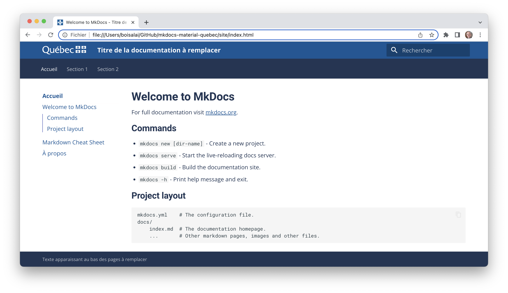

# MkDocs Material Template

Le présent dépôt GitHub propose un gabarit MkDocs Material respectant (le plus possible)
le [système de design du gouvernement du Québec](https://design.quebec.ca/apercu/systeme).



[MkDocs](https://www.mkdocs.org/) est un générateur de site statique rapide, simple et attrayant, 
conçu spécialement pour la création de documentation de projet.

Les fichiers source de la documentation sont rédigés en [Markdown](https://www.markdownguide.org/) 
et configurés à l'aide d'un seul fichier de configuration YAML.

[mkdocs-material](https://squidfunk.github.io/mkdocs-material/) est un thème pour le générateur de documentation MkDocs
prévoyant un ensemble de principes et de directives de conception qui permettent 
de créer des interfaces utilisateur modernes, attrayantes et cohérentes.

## Utilisation

Les instructions ci-dessous supposent que l'utilisateur n'a aucun droit d'administration sur son poste de travail,
n'a pas accès à la fenêtre du terminal, et n'a pas python. 

**Étape 1**: Téléchargez le dépôt GitHub en format compressé ZIP. 

Sauvegardez le fichier ZIP sur votre poste de travail 
et décompressez-le dans un répertoire.


**Étape 2**: Ajoutez et/ou modifiez les pages de documentation.

Rédigez votre documentation dans des fichiers en format markdown (avec l'extension `.md`) 
à l'intérieur du répertoire `mkdocs-material-quebec/doc`. 

Vous pouvez créer et modifier des fichiers markdown avec Visual Studio Code (VS Code). 
Vous pouvez utiliser VS Code directement dans un navigateur web, sans avoir à installer 
l'application sur votre ordinateur. Il suffit d'aller sur [https://vscode.dev/](https://vscode.dev/).


**Étape 3**: Modifiez le fichier de configuration `mkdocs.yaml`.

Plus précisément, changez la ligne `site_name:` par le nom de votre documentation et ajustez l'arboresence débutant 
par `nav:` pour qu'elle présente votre structure de documentation.

```yaml
site_name: Direction XYZ
[...]
nav:
  - Accueil:
    - home/index.md
    - home/markdown-folder/markdown.md
    - home/Markdown-Cheatsheet.md
    - home/about.md
  - Section 1:
    - part1/page1.md
    - part1/page2.md
  - Section 2:
    - part2/page1.md
    - part2/page2.md
```

**Étape 4**: Compressez le répertoire et chargez le fichier compressé dans Google Colab.

Compressez le répertoire `mkdocs-material-quebec` afin de créer le fichier `mkdocs-material-quebec.zip`.

Ouvrez ce [fichier Google Colab](https://colab.research.google.com/drive/17bBL-oIsmS3bYaSN3tf6FhZ1EA9KFEJG?usp=sharing).

Google Colab est une plateforme de développement et d'exécution de code en ligne, principalement 
utilisée pour le langage de programmation Python.

Exécutez la cellule pour charger le fichier `mkdocs-material-quebec.zip` sur le serveur de Google et 
générer une nouvelle version du site statique.

Un fichier compressé `site.zip` devrait être automatiquement téléchargé sur votre ordinateur. Décompressez-le
pour accéder à votre site de documentation mis à jour.


